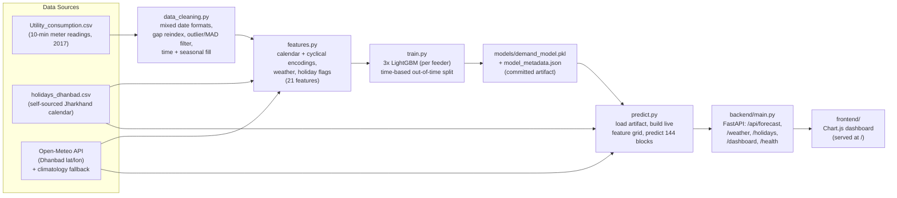

# Apex Power & Utilities — 24-Hour Electricity Demand Forecasting

A complete, runnable forecasting system that predicts **24 hours ahead** of
electrical demand for **three 132 KV feeders** in **Dhanbad, Jharkhand, India**,
at **10-minute resolution (144 blocks/day)**. It pairs a LightGBM model with
localized **weather** (Open-Meteo) and a **self-sourced Jharkhand holiday
calendar**, and serves everything through a FastAPI backend with an interactive
web dashboard.

The trained model artifact is **committed to the repository**, so the API and
dashboard work immediately — no retraining required to run the app.

---

## Table of Contents

1. [Problem Statement](#1-problem-statement)
2. [System Architecture](#2-system-architecture)
3. [Tech Stack](#3-tech-stack)
4. [Project Structure](#4-project-structure)
5. [Data & Data-Quality Handling](#5-data--data-quality-handling)
6. [Weather Integration (Open-Meteo)](#6-weather-integration-open-meteo)
7. [Localized Holiday Calendar (self-sourced)](#7-localized-holiday-calendar-self-sourced)
8. [Model & Why LightGBM](#8-model--why-lightgbm)
9. [Test Metrics](#9-test-metrics)
10. [API Reference](#10-api-reference)
11. [The 10-minute / 144-block Design (and the 96-block remark)](#11-the-10-minute--144-block-design-and-the-96-block-remark)
12. [How to Run](#12-how-to-run)
    - [A. Docker (recommended)](#a-docker-recommended)
    - [B. Local development](#b-local-development)
    - [C. Running the notebook](#c-running-the-notebook)
13. [Reproducibility](#13-reproducibility)

---

## 1. Problem Statement

**Apex Power & Utilities (APU)** operates three 132 KV feeders (`F1`, `F2`, `F3`)
supplying the coal/steel industrial belt around Dhanbad, Jharkhand. To plan
generation, schedule maintenance, and manage load economically, APU needs a
**short-term load forecast**: the expected demand on each feeder (and the total)
for the **next 24 hours**, at the same **10-minute** granularity the SCADA meters
record.

The forecast must account for the real drivers of demand in this region:

- **Time-of-day and weekly cycles** — industrial shift patterns, daily peaks.
- **Weather** — temperature/humidity drive cooling and process load.
- **Local holidays** — Jharkhand state festivals (Sarhul, Karma, Tusu, Chhath)
  and **industrial holidays** (Vishwakarma Puja, Labour Day) materially change
  the load profile of an industrial belt; generic national-only calendars miss
  this.

The deliverable is an **end-to-end, runnable system**: clean the messy meter
data, engineer features, train a model, and expose the forecast through an API
and dashboard.

---

## 2. System Architecture



**Flow in words:** raw meter data → cleaning → feature engineering
(+ weather + holidays) → LightGBM training → committed artifact → FastAPI
inference → web dashboard.

---

## 3. Tech Stack

| Layer            | Technology                                                        |
|------------------|-------------------------------------------------------------------|
| Language         | Python 3.11 (Docker) / 3.13 (tested locally)                      |
| ML / modeling    | LightGBM 4.6, scikit-learn (metrics + split), NumPy, pandas       |
| Persistence      | joblib (model pickle) + JSON metadata                             |
| API              | FastAPI + Uvicorn (ASGI), Pydantic                                |
| Weather          | Open-Meteo (free, no API key) via `requests`, climatology fallback|
| Frontend         | Static HTML/CSS/JS + Chart.js 4 (+ annotation plugin) via CDN     |
| Notebook / EDA   | Jupyter, matplotlib, seaborn                                      |
| Packaging        | Docker (single-stage `python:3.11-slim`), Docker Compose          |

---

## 4. Project Structure

```
power-demand-forecasting/
├── data/
│   ├── Utility_consumption.csv      # raw 10-min meter readings (2017) — included
│   └── holidays_dhanbad.csv         # self-sourced Jharkhand holiday calendar
├── src/
│   ├── config.py                    # geography, feeders, paths, 10-min/144-block constants
│   ├── data_cleaning.py             # mixed-date parsing, gap reindex, outlier/MAD filtering
│   ├── holidays_data.py             # holiday records + per-timestamp holiday flags
│   ├── features.py                  # 21-feature contract (calendar, cyclical, weather, holidays)
│   ├── weather.py                   # Open-Meteo fetch + offline climatology fallback
│   ├── train.py                     # trains 3 LightGBM models, writes artifact + metadata
│   └── predict.py                   # loads artifact, builds live grid, generates forecast
├── models/
│   ├── demand_model.pkl             # COMMITTED trained artifact (API works immediately)
│   └── model_metadata.json          # COMMITTED metrics, feature list, windows, cleaning report
├── notebooks/
│   └── 01_EDA_and_Modeling.ipynb    # exploratory analysis + modeling narrative
├── backend/
│   └── main.py                      # FastAPI app: /api/* JSON + static dashboard at /
├── frontend/
│   ├── index.html                   # dashboard markup
│   ├── app.js                       # fetches /api/dashboard, renders Chart.js
│   └── styles.css                   # dashboard styling
├── requirements.txt                 # runtime deps (API + model)
├── requirements-dev.txt             # + notebook / EDA stack
├── Dockerfile                       # single-stage slim runtime image
├── .dockerignore                    # keeps build context lean
├── docker-compose.yml               # one-command run (app on :8000)
└── README.md                        # this file
```

---

## 5. Data & Data-Quality Handling

The raw file `data/Utility_consumption.csv` contains **52,416 rows** of 10-minute
readings for the full year 2017 (2017-01-01 → 2017-12-30), with columns
`Datetime, Temperature, Humidity, WindSpeed, F1_132KV_PowerConsumption,
F2_132KV_PowerConsumption, F3_132KV_PowerConsumption`.

All cleaning lives in [`src/data_cleaning.py`](src/data_cleaning.py) and emits a
structured report (persisted into `models/model_metadata.json` under
`data_cleaning_report`). Issues handled:

### Mixed date formats
Timestamps are **interleaved** between two formats — some are
`DD-MM-YYYY HH:MM` and some are `MM/DD/YYYY HH:MM`. A single
`pd.to_datetime` guess is unreliable on interleaved data, so we disambiguate by
the **separator**:

- a `-` in the string → **day-first** (`%d-%m-%Y %H:%M`)
- a `/` in the string → **month-first** (`%m/%d/%Y %H:%M`)

Result on this dataset: **0 unparseable datetimes, 0 duplicate timestamps**.

### Missing timestamps / gaps
The series is **reindexed onto a complete 10-minute grid** between the first and
last reading, so any missing intervals become explicit NaNs rather than silent
holes. (On the supplied 2017 file the grid is already complete:
`missing_timestamps = 0`.)

### Outliers and sensor errors
- **Non-positive readings** (`<= 0`) are treated as missing (impossible for live
  feeder load).
- **Statistical outliers** are detected with a robust **rolling-median + MAD**
  filter (≈ one-day centered window, ~6 scaled MADs), which adapts to the local
  level instead of a single global threshold. On this dataset
  **125 outliers** were removed.

### Filling
Cleaned-out / missing values are filled in order of preference:
1. **time interpolation** (respects the real time gaps),
2. a **(month, block-of-day) seasonal climatology** for longer contiguous gaps
   (borrows the typical value for that time-of-day in that month rather than
   smearing a flat line),
3. forward/back fill as a final safety net.

**`gaps_filled = 125`, `remaining_nans = 0`** — the cleaned frame is guaranteed
NaN-free before feature building.

---

## 6. Weather Integration (Open-Meteo)

Implemented in [`src/weather.py`](src/weather.py).

- **Primary source:** the free, **no-API-key** [Open-Meteo](https://open-meteo.com)
  forecast endpoint, queried for **Dhanbad** (`lat 23.7957, lon 86.4304`,
  timezone `Asia/Kolkata`). We request `temperature_2m`,
  `relative_humidity_2m`, `cloud_cover`, and `wind_speed_10m` (km/h).
- **Alignment:** hourly weather is fetched for the forecast window, then
  **upsampled by time-interpolation onto the 10-minute grid** so every one of
  the 144 forecast blocks has its own `Temperature / Humidity / WindSpeed`.
- **Graceful fallback:** if the network is unavailable or the API errors, the
  system degrades to a **climatology fallback** built from the cleaned training
  CSV — monthly-by-hour means of temperature/humidity/wind. Each forecast
  response reports which source was used via the `weather_source` field
  (`"open-meteo"` or `"climatology-fallback"`), so the result is always
  deterministic and offline-safe.
- **Cloud cover note:** `cloud_cover` is **served to the dashboard** for context
  but is **not a model feature** — see [§8](#8-model--why-lightgbm).

---

## 7. Localized Holiday Calendar (self-sourced)

Generic national-holiday libraries do not capture how an **industrial** belt in
**Jharkhand** actually behaves. We therefore **self-sourced** the calendar in
[`data/holidays_dhanbad.csv`](data/holidays_dhanbad.csv) with columns
`date, name, type, is_national, is_festive, is_industrial`. It covers:

- **Jharkhand state festivals:** Sarhul, Karma Puja, Tusu Parab, Chhath.
- **Pan-Indian religious festivals:** Holi, Ram Navami, Janmashtami,
  Eid-ul-Fitr, Diwali, etc.
- **National holidays:** Republic Day, Independence Day, Gandhi Jayanti.
- **Industrial holidays** specific to the coal/steel belt: **Vishwakarma Puja**
  (worshipped industry-wide) and **Labour Day** — these shift the load profile
  of factories even when they are not national holidays.

Years covered: **2017** (for training) and **2024–2026** (so live forecasts on
today's date have holiday context).

[`src/holidays_data.py`](src/holidays_data.py) exposes the calendar two ways:

- **Records** for the API/dashboard (`get_holidays(start, end)`), and
- **Per-timestamp integer flags** for the model
  (`holiday_flags_for_index`): `is_holiday`, `is_festive_holiday`,
  `is_industrial_holiday`. Any reading whose calendar date is a holiday is
  flagged, and festive/industrial flags are OR-ed when multiple entries share a
  date (e.g. Vishwakarma Puja is both festive and industrial).

---

## 8. Model & Why LightGBM

Per-feeder **LightGBM gradient-boosted regressors** (one model each for `F1`,
`F2`, `F3`); the **total** load is the sum of the three predictions.

**Why LightGBM:**

- Strong, robust performance on **tabular** features (calendar + weather +
  holiday flags) — the dominant signal in short-term load forecasting.
- Captures **non-linear interactions** (e.g. hot afternoon **and** a working day)
  without manual interaction terms.
- **Fast to train and infer**, handles the 21-feature × ~52 k-row frame
  comfortably, and ships prebuilt wheels (only `libgomp1` is needed at runtime).
- A **per-feeder** model lets each feeder learn its own behaviour while keeping
  the design simple and interpretable via feature importance.

**Features (21 total)** — exact contract shared by train and serve
(`src/features.py`): calendar fields (`block_of_day, hour, minute, dayofweek,
day, month, dayofyear, weekofyear, is_weekend`), **cyclical encodings**
(`block_sin/cos, dow_sin/cos, month_sin/cos`), weather
(`Temperature, Humidity, WindSpeed`), and holiday flags
(`is_holiday, is_festive_holiday, is_industrial_holiday`).

**Evaluation split:** a **time-based out-of-time split** — first ~92% of 2017 for
training, the **last ~8% (≈ the final four weeks of December 2017)** held out for
test. This measures genuine *forecasting* skill rather than leaking future
patterns into the past.

> `cloud_cover` is intentionally **excluded as a model feature**: it is absent
> from the 2017 training CSV, so excluding it keeps the train-time and
> serve-time feature spaces identical. It is still fetched and shown on the
> dashboard.

The full exploratory analysis and modeling narrative — including feature
importance and error analysis — live in
[`notebooks/01_EDA_and_Modeling.ipynb`](notebooks/01_EDA_and_Modeling.ipynb).

---

## 9. Test Metrics

Held-out out-of-time test set: **4,193 blocks**
(2017-12-01 21:10 → 2017-12-30 23:50), trained on **48,223 blocks**
(2017-01-01 → 2017-12-01 21:00). Numbers below are pulled directly from
[`models/model_metadata.json`](models/model_metadata.json) (LightGBM 4.6.0).

| Target    | MAE       | RMSE      | MAPE    | R²      |
|-----------|-----------|-----------|---------|---------|
| **F1**    | 1437.15   | 1909.95   | 5.02 %  | 0.9221  |
| **F2**    | 1030.84   | 1485.58   | 5.03 %  | 0.9314  |
| **F3**    | 1286.88   | 1619.95   | 10.68 % | 0.9240  |
| **TOTAL** | 2749.53   | 3585.08   | **4.44 %** | **0.9499** |

The total system load is forecast with **~4.4 % MAPE** and **R² ≈ 0.95** on
unseen December data — strong out-of-time accuracy. (MAE/RMSE are in the same
units as the meter readings, kW.)

---

## 10. API Reference

Implemented in [`backend/main.py`](backend/main.py). The server mounts the static
dashboard at `/` and the JSON API under `/api`. Interactive docs are available at
**`/docs`** (Swagger UI) and **`/redoc`**.

Base URL when running locally or via Docker: `http://localhost:8000`

> All numeric loads are in kW; all timestamps are ISO-8601 local
> (`Asia/Kolkata`) wall-clock.

### `GET /api/health`
Liveness probe with model + location context.

```json
{
  "status": "ok",
  "model_loaded": true,
  "location": "Dhanbad, Jharkhand, India",
  "latitude": 23.7957,
  "longitude": 86.4304,
  "timezone": "Asia/Kolkata",
  "time": "2026-06-23T14:30:00"
}
```

### `GET /api/forecast`
Full demand forecast. **144 ten-minute blocks** for the default 24 h.

**Query params:** `hours` (int, default `24`, range `1–72`).

```json
{
  "generated_at": "2026-06-23T14:30:00",
  "location": "Dhanbad, Jharkhand, India",
  "latitude": 23.7957,
  "longitude": 86.4304,
  "interval_minutes": 10,
  "n_blocks": 144,
  "horizon_hours": 24,
  "weather_source": "open-meteo",
  "model_metrics": { "F1": { "MAE": 1437.15, "RMSE": 1909.95, "MAPE": 5.02, "R2": 0.9221 }, "...": {} },
  "forecast": [
    {
      "block": 87,
      "timestamp": "2026-06-23T14:30:00",
      "hour": 14,
      "F1": 31250.41,
      "F2": 18420.77,
      "F3": 21003.55,
      "total_load_kw": 70674.73
    }
  ]
}
```
Errors: `503` if the model artifact is missing; `500` on internal failure.

### `GET /api/weather`
Next-24 h hourly weather, aligned to the forecast start hour.

**Query params:** `hours` (int, default `24`, range `1–72`).

```json
{
  "location": "Dhanbad, Jharkhand, India",
  "latitude": 23.7957,
  "longitude": 86.4304,
  "source": "open-meteo",
  "hourly": [
    {
      "timestamp": "2026-06-23T14:00:00",
      "temperature_c": 34.2,
      "humidity_pct": 51.0,
      "cloud_cover_pct": 40.0,
      "wind_speed_kmh": 12.6
    }
  ]
}
```
`source` is `"open-meteo"` or `"climatology-fallback"`.

### `GET /api/holidays`
Localized holidays in `[start, end]` (inclusive). Defaults to **today → today+30 days**.

**Query params:** `start` (`YYYY-MM-DD`, optional), `end` (`YYYY-MM-DD`, optional).

```json
{
  "location": "Dhanbad, Jharkhand, India",
  "start": "2026-06-23",
  "end": "2026-07-23",
  "count": 1,
  "holidays": [
    {
      "date": "2026-07-06",
      "name": "Muharram",
      "type": "religious",
      "is_festive": true,
      "is_industrial": false,
      "is_national": false
    }
  ]
}
```
Errors: `400` on an invalid date range.

### `GET /api/dashboard`
One-shot payload combining `forecast`, `weather`, and `holidays`, all aligned to
the same forecast window — this is what the frontend calls.

**Query params:** `hours` (int, default `24`, range `1–72`).

```json
{
  "forecast": { "...": "same shape as GET /api/forecast" },
  "weather":  { "...": "same shape as GET /api/weather" },
  "holidays": {
    "location": "Dhanbad, Jharkhand, India",
    "start": "2026-06-23",
    "end": "2026-06-25",
    "count": 0,
    "holidays": []
  }
}
```
Weather/holidays degrade gracefully (empty/unavailable) if a source fails, so the
forecast still renders.

### `GET /`
Serves the dashboard (`frontend/index.html`). If the frontend directory is
missing, returns a JSON pointer to the available `/api/*` endpoints instead.

---

## 11. The 10-minute / 144-block Design (and the 96-block remark)

The supplied meter data is recorded **every 10 minutes**, which gives
**24 h × 60 min ÷ 10 min = 144 blocks per day**. This system forecasts at the
**native 10-minute / 144-block resolution** end-to-end: cleaning, features,
training, and the API all operate on 144 blocks (`config.INTERVAL_MIN = 10`,
`config.BLOCKS_PER_DAY = 144`).

The assignment brief mentions a **"96-block"** daily structure, which corresponds
to the common Indian electricity-market convention of **15-minute** time blocks
(24 h × 60 ÷ 15 = 96). We deliberately kept the model at the **dataset's actual
10-minute cadence** because:

1. It matches the **real sampling rate** of the provided meter readings — no
   information is discarded by down-sampling to 15 minutes.
2. It gives **finer operational granularity** for short-term load decisions.
3. The block index is fully **configurable**: the interval is a single constant
   in `src/config.py`. The pipeline is resolution-agnostic, so a 96-block /
   15-minute variant is a one-line change (`INTERVAL_MIN = 15`,
   `BLOCKS_PER_DAY = 96`) followed by a retrain. Each forecast block exposes both
   its `block` index and an absolute ISO `timestamp`, so consumers can re-bucket
   to 15-minute (96-block) windows downstream if required.

---

## 12. How to Run

### A. Docker (recommended)

Prerequisites: Docker + Docker Compose. No Python setup, no model training — the
trained artifact is committed.

```bash
# from the project root: power-demand-forecasting/
docker compose up --build
```

Then open: **http://localhost:8000**

- API docs: http://localhost:8000/docs
- Health:   http://localhost:8000/api/health

Stop with `Ctrl+C`, then `docker compose down`.

> Equivalent without Compose:
> ```bash
> docker build -t power-demand-forecasting .
> docker run --rm -p 8000:8000 power-demand-forecasting
> ```

### B. Local development

Prerequisites: Python 3.11+ (tested on 3.13).

```bash
# 1) from the project root, create & activate a virtual environment
python -m venv .venv

# Windows (PowerShell):
.venv\Scripts\Activate.ps1
# Windows (Git Bash):
source .venv/Scripts/activate
# macOS / Linux:
source .venv/bin/activate

# 2) install runtime dependencies
pip install -r requirements.txt

# 3) (OPTIONAL) regenerate the model from the included data
#    The repo already ships models/demand_model.pkl, so this is NOT required.
python -m src.train

# 4) start the API + dashboard (auto-reload for development)
python -m uvicorn backend.main:app --reload
```

Then open: **http://localhost:8000**

> Always run `uvicorn` from the **project root** so `import src` resolves.
> (`backend/main.py` also inserts the project root onto `sys.path` defensively.)

### C. Running the notebook

The EDA / modeling notebook needs the extra plotting + Jupyter stack:

```bash
pip install -r requirements-dev.txt   # installs requirements.txt too
jupyter notebook
```

Then open `notebooks/01_EDA_and_Modeling.ipynb`.

---

## 13. Reproducibility

- **The dataset is included** (`data/Utility_consumption.csv` and
  `data/holidays_dhanbad.csv`) so the pipeline runs end-to-end with no external
  downloads.
- **The trained model is committed** (`models/demand_model.pkl` +
  `models/model_metadata.json`), so the API/dashboard work immediately and the
  quoted metrics are exactly reproducible.
- Training uses a fixed `random_state=42` and a deterministic time-based split;
  rerunning `python -m src.train` reproduces the committed metrics.
- Weather is **offline-safe**: if Open-Meteo is unreachable, the system falls
  back to a climatology derived from the included data, and every response
  reports which source was used.
